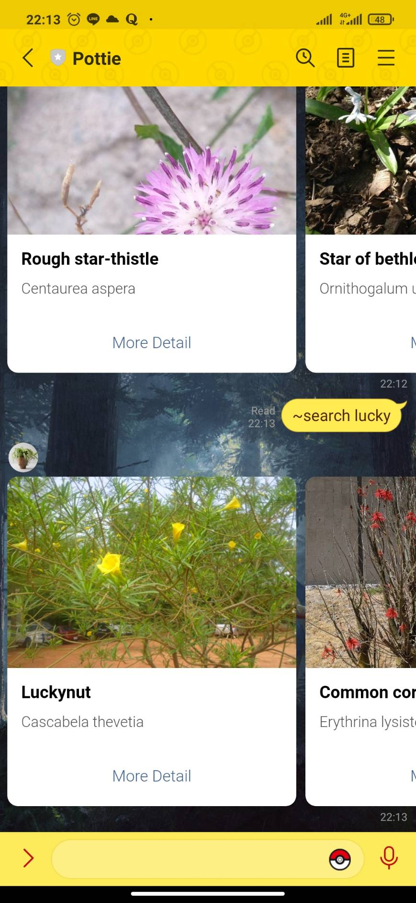
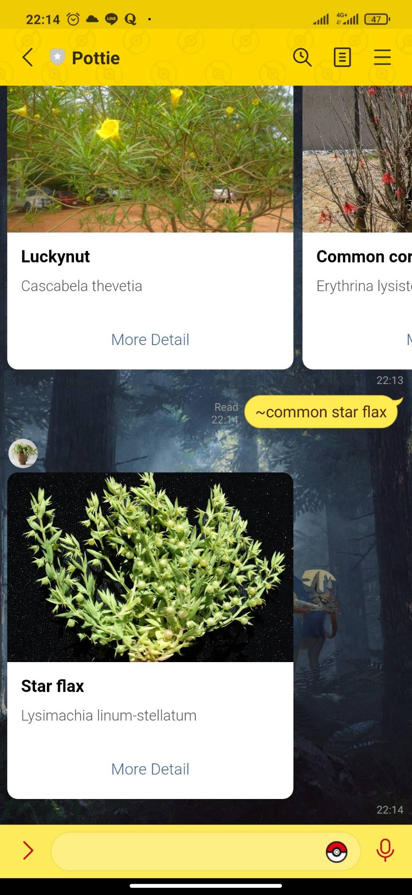
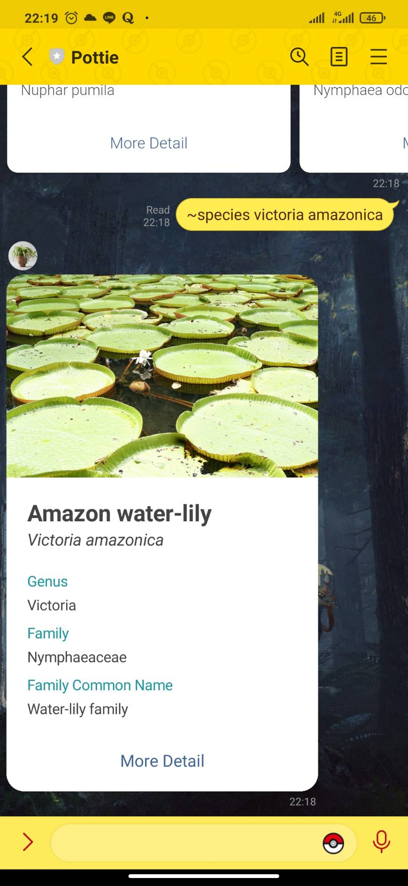
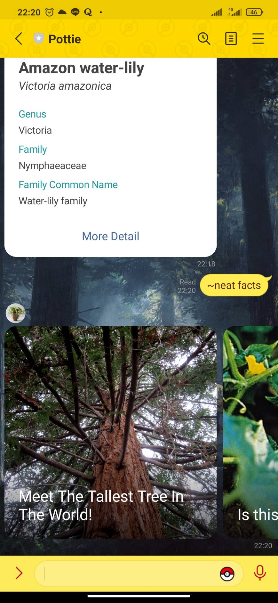
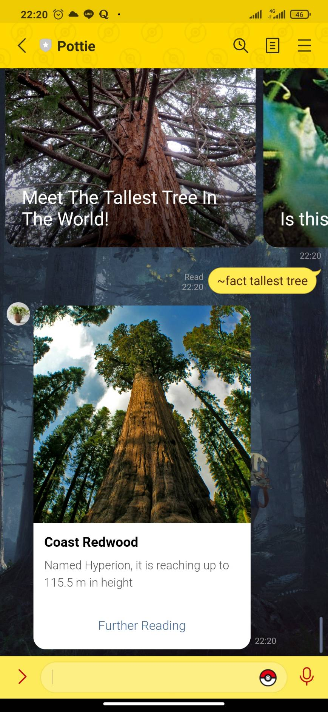

# Pottie
## A Digital Plant Dictionary

Pottie is a chatbot build with LINE messaging API that can help you to search any plant you want to know more about.

You can add her by this ID **@460ywdvy**

or just scan this QR from your phone

### Features:
1. Search with any keyword

   You can search as usual using any keyword and the bot show carousel of search result.
   
   

2. Search with the common name
   
   Search with the common name of the plant. This may be tricky since the common name may differ from one region to another region.
   
   
   
3. Search with a scientific name

   Search with the scientific name of a plant. The bot shows a plant with its scientific name, common name, and family of that plant belong
   
   

4. Neat facts
   The bot will show you some carousel images with a topic you may want to know more about. Choose one of them and the bot send you a short fact based on what you choose. 
   
   &nbsp;&nbsp;
   

> If you click the detail button the bot will redirect you to the Wikipedia page based on the plant you choose
